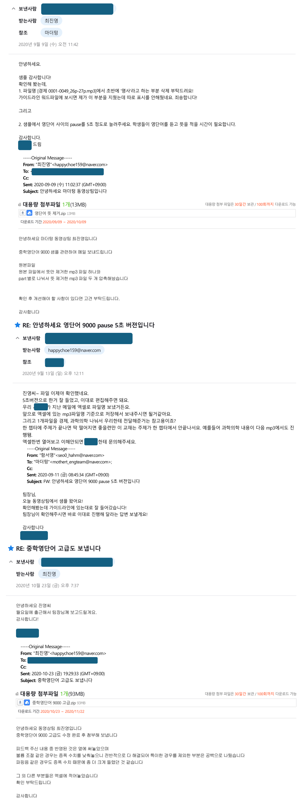
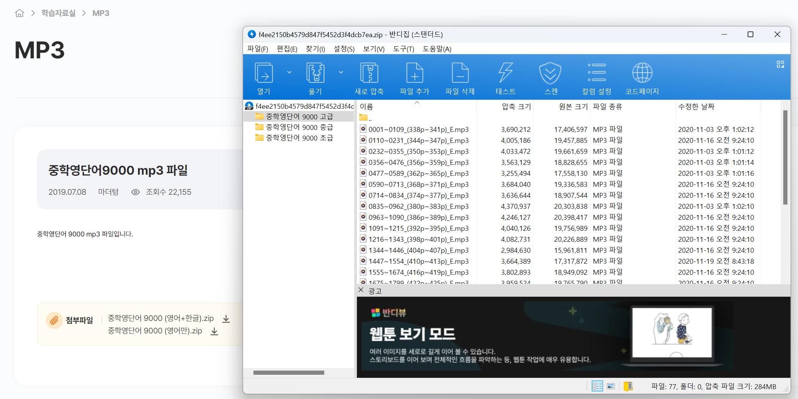

# 💼 NHN 이력서 내 경력 참고 자료

## 👋 인삿말
안녕하세요. NHN 총무 직무에 지원한 최진영입니다.  
이력서 경력사항에 기입한 내용 중 '마더텅 동영상팀'에서의 활동을  
보다 쉽게 이해하실 수 있도록 본 GitHub 리포지토리를 준비했습니다.  
확인해 주셔서 감사합니다.

---

## 📝 중학영단어 9000 받아쓰기용 MP3 제작
- **📌 배경**: 고객 요청으로 기존 MP3 외에 받아쓰기용 MP3 제작.
- **🎯 역할**: 프로젝트 전담, 음원 재편집, 교재팀 피드백 반영.
- **🌟 성과**: 비용 없이 MP3 제작 완료, 출판사 홈페이지에 현재 제공 중.

### 🔍 프로젝트 참고 자료
1. **프로젝트 관련 담당자와 주고받은 이메일 중 일부**    
     

2. **최종 결과물 (출판사 홈페이지)**  
   

---

## 🛠️ 촬영용 비품ㆍ소모품 구매 및 관리
- **📌 배경**: 동영상팀 팀장이 1년간 공석인 관계로, 제가 비품과 소모품 구매를 담당하였습니다.
- **🎯 역할**: 비품ㆍ소모품 구매 및 관리

### 🔍 업무 관련 자료
1. **물품 구매 관련 경리팀과 주고받은 이메일**  
     
2. **음성 송수신기 수리**  
     
---
